<p align="center">
  <a href="https://saxo.dance">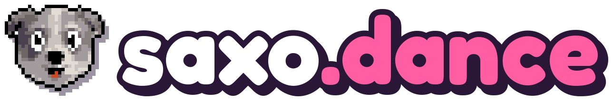</a>
</p>

<p align="center">
  <b>A scruffy grey terrier in a check suit dances to pop hits in PlayStation&nbsp;1 worlds.</b><br>
  4 videos a day, made entirely in code: three.js draws every frame, ffmpeg cuts it, and a routine that runs all night
  makes and schedules them.
</p>

<p align="center">
  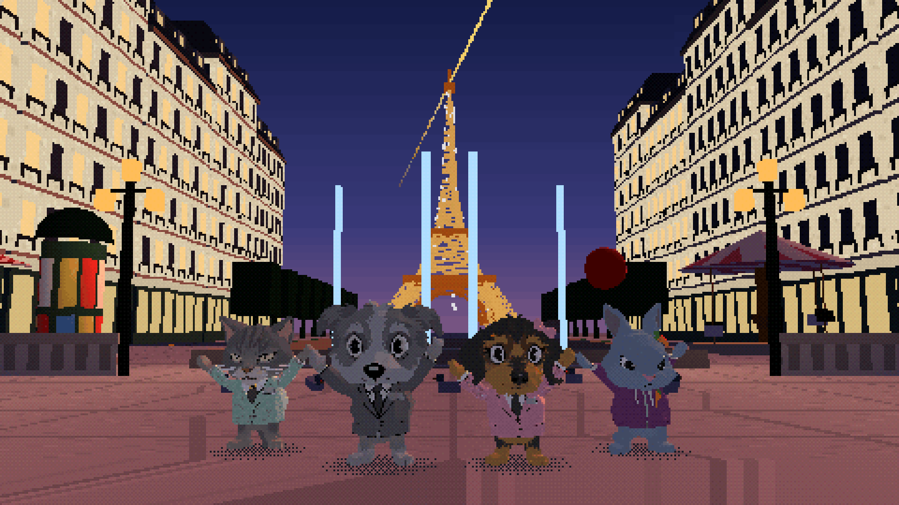
</p>

<p align="center">
  <a href="https://www.tiktok.com/@saxo.dance"></a>
  <a href="https://www.instagram.com/saxo.dance"></a>
  <a href="https://www.youtube.com/channel/UCkJ-SUUz6dUcAmpfYQ4zZng"></a>
  <a href="https://x.com/saxodance"></a>
  <a href="https://saxo.dance"></a>
  <a href="https://claude.com/claude-code"></a>
</p>

<div align="center">
  <table>
    <tr>
      <td align="center"><h3>4</h3>characters</td>
      <td align="center"><h3>46</h3>looks</td>
      <td align="center"><h3>38</h3>maps</td>
      <td align="center"><h3>467</h3>dance and action clips</td>
      <td align="center"><h3>6</h3>videos posted</td>
      <td align="center"><h3>4</h3>videos a day</td>
      <td align="center"><h3>$0</h3>to render</td>
    </tr>
  </table>
</div>

> [!NOTE]
> **Public mirror.** This is the public copy of a private repo, updated on every push: the renderer, the maps, the website and the tools are all here. The songs, lyrics, Mixamo clips, 3D models and research notes stay private, so the renderer won't run out of the box.

## What a video looks like

<table>
  <tr>
    <td width="290" valign="top">
      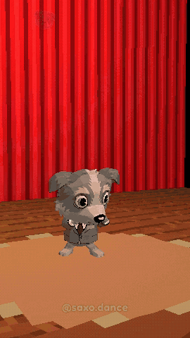
      <br><sub>25 Sept, "Dans le club" (Michou): a yacht party in Saint-Tropez, and every toast cuts back to Kob, who never goes out.</sub>
    </td>
    <td valign="top">
      <p><b>The format.</b> A short story on a hit song, cut to at least 62 seconds on section boundaries, never
      mid-line. Each episode parodies the song's own music video with our cast: a hook in the first two seconds, a
      running gag that comes back changed each time, a payoff in the last chorus, and one silent beat to end on. The
      camera films as if someone were there: a lens a few centimetres off the floor, tilted horizons, bodies across the
      lens, a swoop down to the dancers for the hook and deadpan stares at whoever refuses to dance. Every cut lands on
      a beat, and the camera punches in on every beat.</p>
      <p><b>The karaoke.</b> Each word springs in as it is sung, in chunky PS1 type: the sung word yellow, the rest pink,
      the longest-held word bigger and shaking. The singer's 8-bit face hops from word to word.</p>
      <p><b>The jokes.</b> Every lyric that names an action is acted out on the word. Four characters who each have one
      job keep their running gags going from video to video, plus costume changes on the beat, crowds, giants (a
      19-metre bunny rising from the sea), a flight through turbulence over erupting volcanoes, thrown props, a fight
      with a slow-motion replay and skate tricks.</p>
      <p><b>The loop.</b> Trends go in; views, likes and shares come back out into a playbook that the next video
      reads.</p>
    </td>
  </tr>
</table>

## Meet the gang

<table>
  <tr>
    <td align="center" width="25%">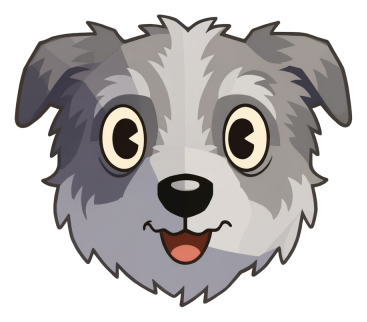<br><b>Saxo</b></td>
    <td align="center" width="25%"><br><b>Sadi</b></td>
    <td align="center" width="25%">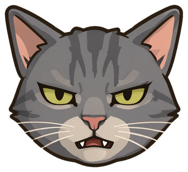<br><b>Kob</b></td>
    <td align="center" width="25%">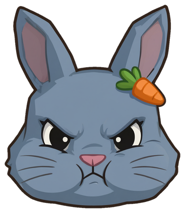<br><b>Compote</b></td>
  </tr>
  <tr>
    <td valign="top">Scruffy grey terrier in a check suit. Always the lead, confident, a bit off: the joke is usually on him.</td>
    <td valign="top">Black-and-tan terrier with a pink bow. The romance and the reality check: falls for him, then sees through him.</td>
    <td valign="top">Grey tabby in a mint tweed blazer and a bell collar. Grumpy, never impressed, secretly the best dancer.</td>
    <td valign="top">Grey dwarf bunny in a plum hoodie, carrot clip in her hair. Always angry. Ask her for one carrot and find out.</td>
  </tr>
</table>

<p align="center">
  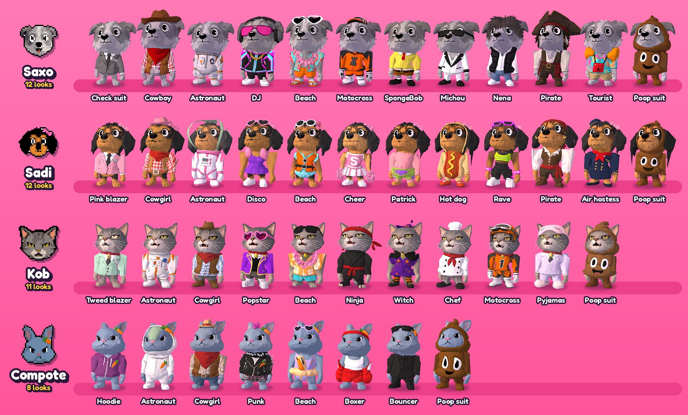
</p>

Each map dresses the cast for the occasion: astronaut suits on the moon, cowboy hats out west, SpongeBob and Patrick
in Bikini Bottom, a hot dog in the supermarket. The poop suit is never automatic; an episode has to ask for it.

## 38 maps, and counting

<p align="center">
  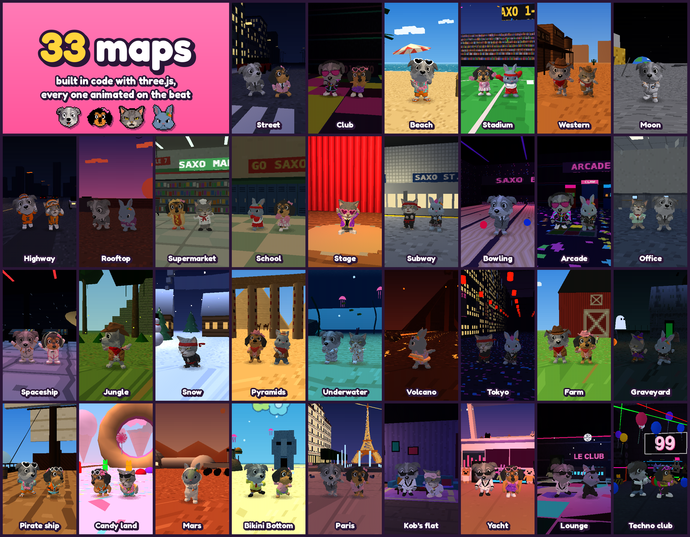
</p>

Every map is built from primitives in [`src/maps*.js`](src/) and animated as a pure function of time, mostly on the
beat; each episode adds one to three for its story. The club floor flashes, a subway train passes every 16 beats, a
locker bangs open every bar, the volcano erupts, the bowling ball strikes every two bars, in Paris the fountains fire
on the beat while the Eiffel Tower sparkles on each bar, and the techno club's ceiling net lets its balloons go on the
drop.

## How a video gets made

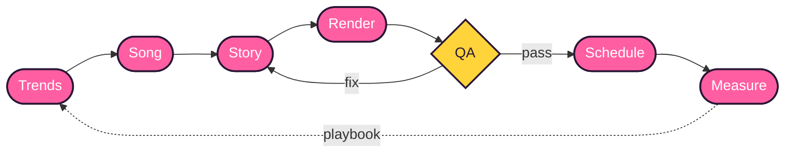

Every night a scheduled run wakes every 30 minutes, asks `tools/night.mjs` whether anything is
due, and follows `research/DAILY_ROUTINE.md` to make one video at a time, with no
approval step and a budget per video. The first starts at 21:00 and the others no earlier than 23:00, 01:00 and 03:00;
each is scheduled for one of the next day's slots, at 08:00, 12:00, 16:00 and 20:00.

1. **Scout.** [`tools/trends.mjs`](tools/trends.mjs) scans what is going viral in our niches, and live meme formats
   land in `research/MEMES.md`. Songs asked for in
   `research/SONG_QUEUE.md` come first, then a trending song, then a throwback that trends
   again.
2. **Song.** [`tools/cut_song.mjs`](tools/cut_song.mjs) takes the track and a word-level transcript and picks a window of
   62 s or more that starts and ends on section boundaries, preferring to end on the chorus. It writes the audio and
   the karaoke timings; [`tools/beats.mjs`](tools/beats.mjs) finds the BPM, the first beat and the bars.
3. **Story.** The song's official video is studied frame by frame, then parodied: four to six story beats over the
   song's sections, the whole cast placed shot by shot, and new maps and costumes made for it. A generator script
   writes the shot list on the beat grid ([`episodes/`](episodes/)): for each shot a map, a camera placed by position
   ([`episodes/cam.py`](episodes/cam.py)), a dance, who is in it, what they wear and hold, plus crowds and action
   scenes. Without an episode, the shot planner builds one
   from the song.
4. **Render.** [`render.mjs`](render.mjs) drives [`studio.html`](studio.html) in headless Chrome across four tabs, then
   ffmpeg encodes the frames with the song, loudness-normalised to −14 LUFS.
5. **Check.** The QA gate runs before a single frame is rendered (see below), then come contact sheets, zoomed stills,
   an independent reviewer that sees one frame per shot, and a critic's score before anything is posted.
6. **Ship.** [`publish.mjs`](publish.mjs) schedules the video on TikTok, Instagram Reels, YouTube Shorts and X for its
   slot, with per-platform captions and hashtags. YouTube gets a cut of 60 s or less that keeps the episode's ending.
   Ten minutes after each post goes out, `tools/post_check.mjs` checks it is live, public and
   audible.
7. **Measure.** [`tools/metrics.mjs`](tools/metrics.mjs) snapshots every post at 24 h and 72 h against the channel
   median. Rules that hold up go into `research/PLAYBOOK.md`, which the next run reads.

## Under the hood

### The PS1 look

<p align="center">
  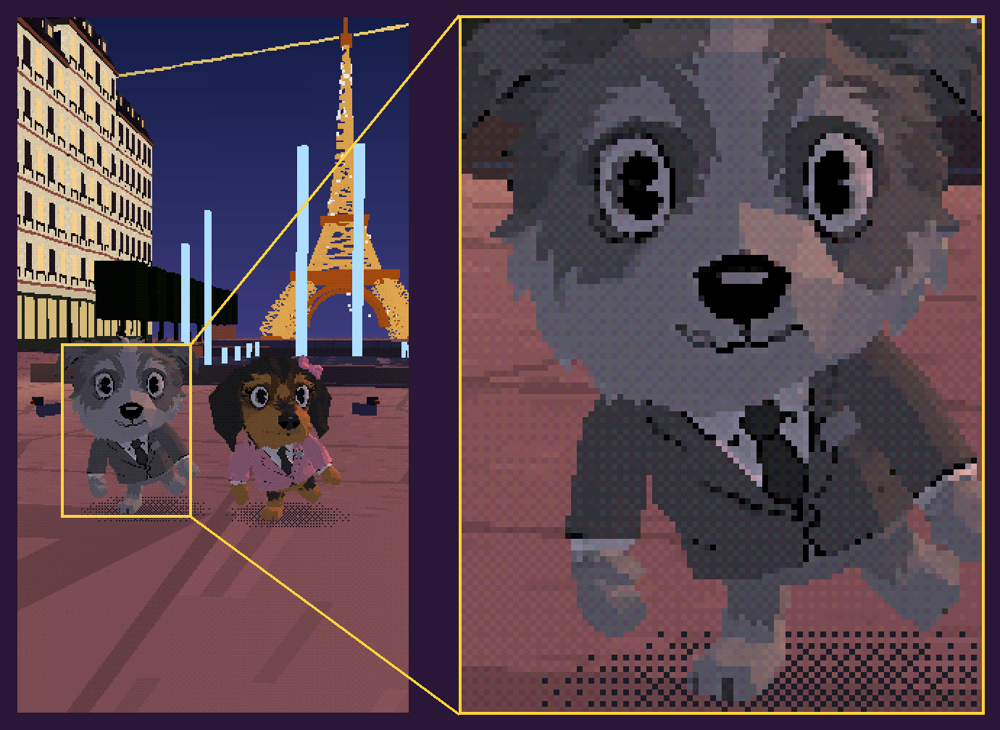
</p>

The 3D is drawn at **270 × 480** with a custom `ShaderMaterial` and scaled up 4× with nearest-neighbour to 1080 × 1920.
What makes it read as a PlayStation game:

- vertices snapped to a 135 × 240 grid, so edges wobble as the camera moves;
- affine texture mapping, with big surfaces cut into ~1.5 m tiles so floors don't swim;
- per-vertex lighting, nearest filtering, and fog;
- 15-bit colour with a 4 × 4 Bayer dither;
- characters with flat normals, so they stay faceted low-poly toys;
- a dithered, screen-door blob shadow tinted to each map's ground.

### One skeleton for everyone

Only Saxo is rigged (Mixamo). Every other character and every costume is an unrigged low-poly model: a four-view
turnaround sheet is drawn from a photo, then turned into 3D ([`tools/character.mjs`](tools/character.mjs)). When the
page loads, each model is fitted over Saxo's body (arm-span scale, feet aligned, best of four orientations) and every
vertex copies the bone weights of its six nearest body vertices. The partners ride clones of his skeleton, so all
467 clips in `assets/mixamo/anims/` play on anyone, with no Blender and no re-rigging. A crowd
goes further: up to 99 copies of one look share a single hidden skeleton, so a whole room dances in sync for the price
of one pose. Any of them can also be scaled up into a giant that rises out of the sea and sinks back.

### A QA gate that can say no

`node render.mjs --qa` samples every frame at 10 fps and measures each character's **skinned mesh**, not its bones:
nobody may sink more than 4 cm into the floor, float more than 5 cm for longer than a jump, or leave the frame for
more than half a second, and a body lying down must rest on its torso (a chibi head is wider than the torso is thick,
so the head is allowed through the floor). `--frames` and `--clip` run the gate first and refuse to render on a failure. Every new failure
found by eye becomes a new rule: a leftover T-pose and a comic word badge now fail it too.

### Deterministic frames

The whole video is a pure function of `t`: `window.render3d(t)` picks the shot, lights the map, poses the cast and
renders. Frames can be drawn out of order in parallel tabs, and an interrupted render resumes where it stopped.

## saxo.dance

<p align="center">
  <a href="https://saxo.dance">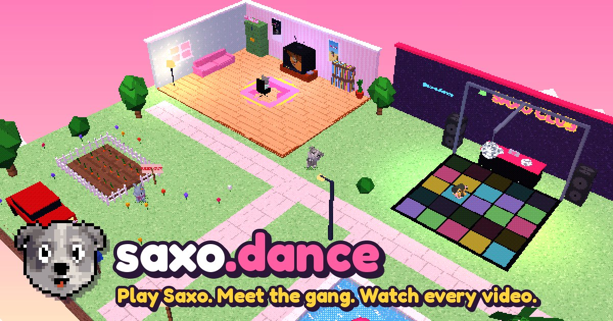</a>
</p>

<p align="center">
  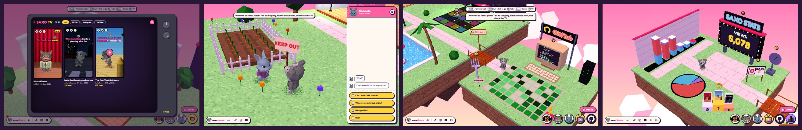
</p>

A playable version of the channel in the same PS1 look. Walk Saxo around a floating diorama (the living room, the club,
Compote's carrot garden, the pool), talk to the gang in branching chats, dress up in every costume, and watch every
video on **Saxo TV**. Across the bridge east of the pool, the GitHub island's giant computer opens this
repository; across the one west of the living room, the stats island counts every view, like and follower: a stadium
scoreboard, a bar chart of the latest videos stacked by platform, a pie chart you walk on and a podium of the three
most-watched videos, refreshed at every deploy from the platforms' free public numbers. It is plain ES modules and
three.js bundled with esbuild ([`site/`](site/)), with a WebAudio house loop synthesised in the browser: no audio files.

## Quick start

Needs Node 22+, Google Chrome, ffmpeg, and Python 3 with Pillow for the sticker tools. `--gl=metal` picks Chrome's
Metal backend on macOS.

```bash
npm install

# preview in the browser, with sound: http://127.0.0.1:5173/studio.html
node render.mjs --serve

# look before rendering: a contact sheet at chosen times, then the QA gate
node render.mjs --sheet=0.5,3,6,9,12,15 --gl=metal --out=out/check/sheet.jpg
node render.mjs --qa --gl=metal

# render every frame (4 parallel tabs), then encode with the song
node render.mjs --frames --workers=4 --gl=metal
node render.mjs --encode --out=out/my-video.mp4

# render an episode instead of the planner's cut
node render.mjs --frames --workers=4 --gl=metal --query=episode=2026-09-25

# captions and hashtags for each platform, without posting
node publish.mjs out/my-video.mp4 --dry-run
```

Handy page params for previews (`--query=a=b&c=d`, or in the studio URL): `map=paris` forces a map,
`maps=club,moon,paris` sets the rotation, `cast=duo&with=kob` puts a partner beside Saxo, `outfit=sponge` forces a look,
`scene=fight` renders an action scene, `bounce=0` turns off the beat punch.

## Repository map

| Path | What's inside |
|---|---|
| [`render.mjs`](render.mjs) | the renderer: preview, contact sheets, stills, QA gate, frames, encode, GIF |
| [`src/ps1.js`](src/ps1.js) | the 3D side: PS1 shader, characters and costumes, camera moves, shot planner |
| [`src/maps*.js`](src/), [`src/mapkit.js`](src/mapkit.js) | the maps and their shared building blocks |
| [`src/scenes.js`](src/scenes.js) | action scenes: skate, fight |
| [`src/ch/dance.js`](src/ch/dance.js) | the 2D layer: karaoke, stickers, comic bursts, watermark |
| [`episodes/`](episodes/) | one shot list per posted video |
| [`assets/`](assets/) | the stickers, pixel icons, profile pictures and the font (the rig, clips, 3D models and songs are private) |
| [`tools/`](tools/) | song cutting, beats, the character pipeline, stickers, metrics, trends, the night's state and post checks, the website tools |
| [`publish.mjs`](publish.mjs) | posts a render to TikTok, Instagram, YouTube and X |
| [`site/`](site/) | saxo.dance |

## What it costs

| What | Cost |
|---|---|
| **Rendering a video** | **$0**: three.js and ffmpeg on a laptop |
| A new character or costume | $0.50 for the 3D model, $0.04 per reference image |
| A new map | free: built from primitives in code |
| Dance and action clips | free (Mixamo): 467 clips on disk |
| Posting | free on TikTok, Instagram and YouTube; $0.015 a post on X, whose API has no free tier |
| Caps per video | $1 of images and APIs, plus up to four new looks ($2 of 3D models), logged in `research/spend.jsonl` |

Pay once for reusable assets, never for a render: every look a video buys joins the wardrobe for the next ones.

<p align="center">
  <br>
  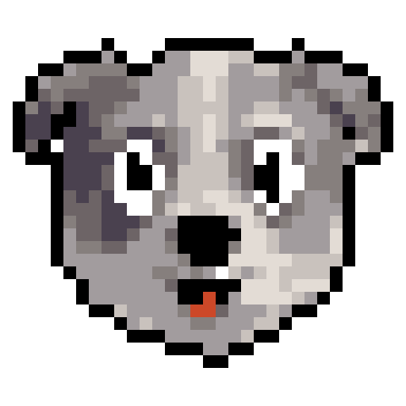
  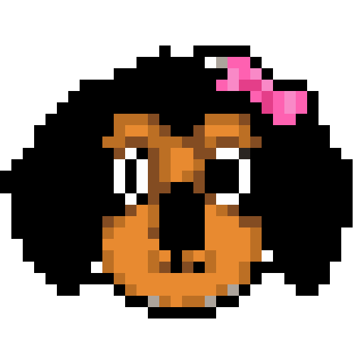
  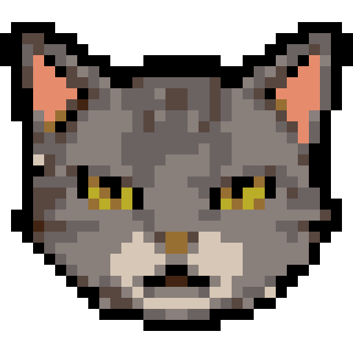
  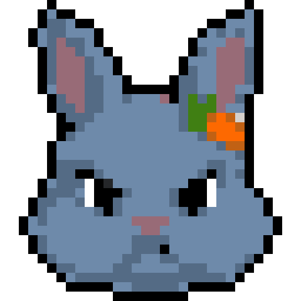
  <br>
  <sub>Made with three.js, ffmpeg, a lot of beat-matching, and Claude Opus 5.5.</sub>
</p>
